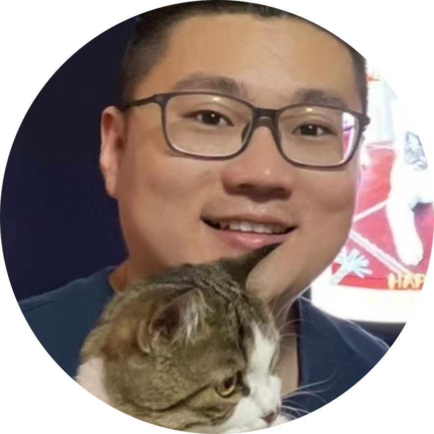
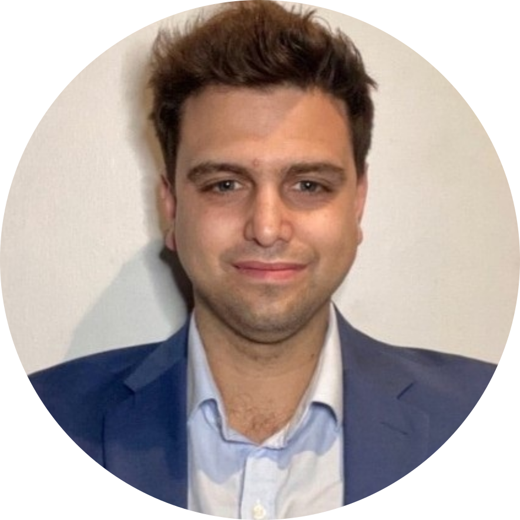
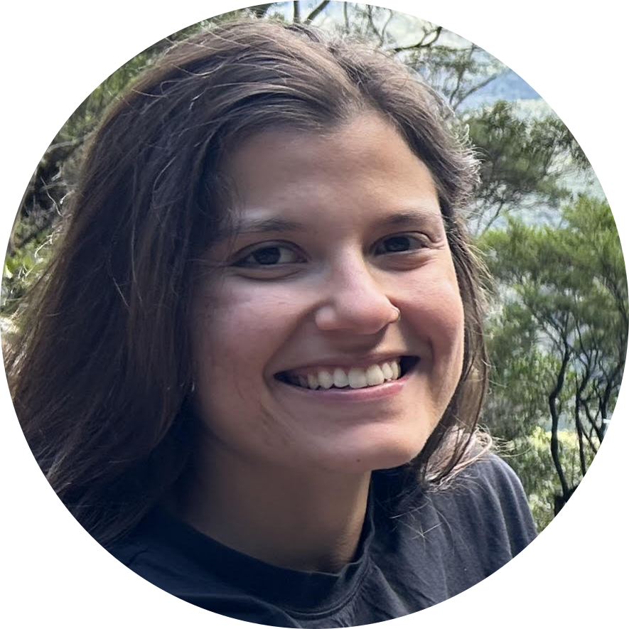
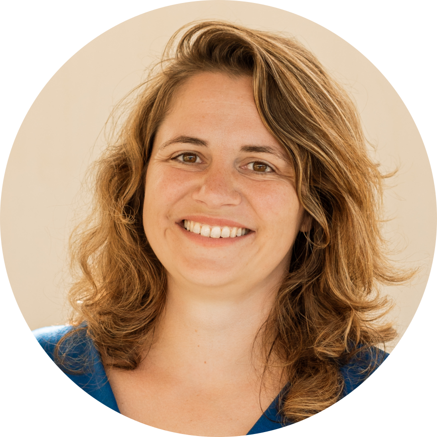
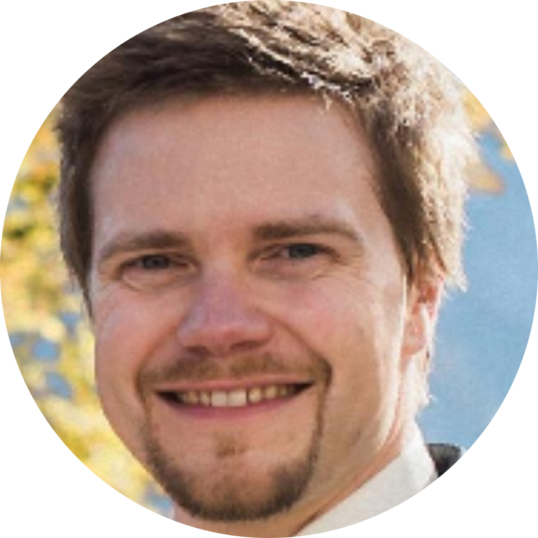
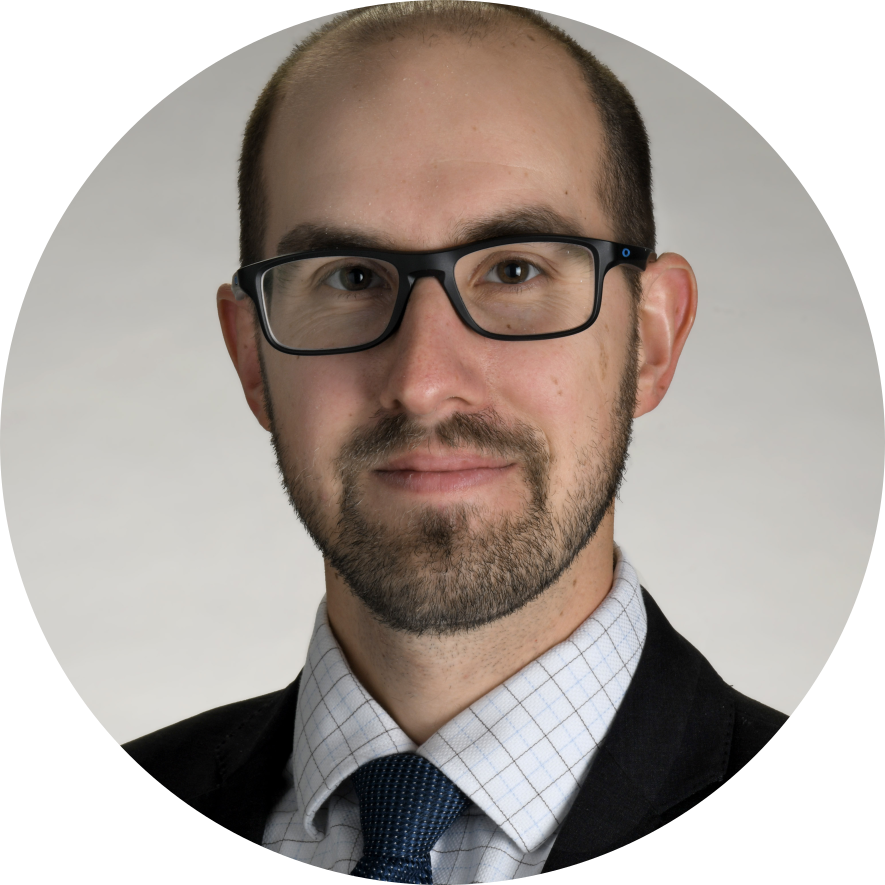

---
title: Organizing Committee
layout: default
description: Workshop's organizing committee
year: 2024
--- 

<svg width="1000" height="800">
<?xml version="1.0" encoding="utf-8"?>
<!-- Generator: Adobe Illustrator 23.1.1, SVG Export Plug-In . SVG Version: 6.00 Build 0)  -->
<svg version="1.1" id="Layer_1" xmlns="http://www.w3.org/2000/svg" xmlns:xlink="http://www.w3.org/1999/xlink" x="0px" y="0px"
     viewBox="0 0 875.1 692.8" style="enable-background:new 0 0 875.1 692.8;" xml:space="preserve">

<image style="overflow:visible;" width="1886" height="1018" xlink:href="images/committee/commitee_24_2.png"  transform="matrix(0.5 0 0 0.5 -30 100)">
</image>
<a xlink:href="https://scholar.google.com/citations?user=xk_DKEYAAAAJ&hl=en" >
    <text transform="matrix(1 0 0 1 735 295)" class="st1 st2" font-weight="bold">Bin Lu </text>
    <text transform="matrix(1 0 0 1 780 295)" class="st1 st3" font-weight="bold">(he/him)</text>
    <text transform="matrix(1 0 0 1 675 310)" class="st1 st2" font-weight="bold">Chinese Academy of Sciences (CHN)</text>
</a>
<a xlink:href="https://www.linkedin.com/in/cristian-montalba-zalaquett/" >
    <text transform="matrix(1 0 0 1 250 565)" class="st1 st2" font-weight="bold">Cristian Montalba </text>
    <text transform="matrix(1 0 0 1 350 565)" class="st1 st3" font-weight="bold">(he/him; co-chair)</text>
    <text transform="matrix(1 0 0 1 230 580)" class="st1 st2" font-weight="bold">Pontificia Universidad Católica de Chile (CHL)</text>
</a>
<a xlink:href="https://www.linkedin.com/in/fernanda-ribeiro-849a09102/" >
    <text transform="matrix(1 0 0 1 660 580)" class="st1 st2" font-weight="bold">Fernanda Ribeiro </text>
    <text transform="matrix(1 0 0 1 755 580)" class="st1 st3" font-weight="bold">(she/her; co-chair)</text>
    <text transform="matrix(1 0 0 1 670 595)" class="st1 st2" font-weight="bold">University of Queensland (AU)</text>
</a>
<a xlink:href="https://www.linkedin.com/in/patricia-clement-neuroimaging-researcher/" >
    <text transform="matrix(1 0 0 1 400 200)" class="st1 st2" font-weight="bold">Patricia Clement </text>
    <text transform="matrix(1 0 0 1 490 200)" class="st1 st3" font-weight="bold">(she/her)</text>
    <text transform="matrix(1 0 0 1 400 215)" class="st1 st2" font-weight="bold">Ghent University (BE)</text>
</a>
<a xlink:href="https://www.linkedin.com/in/lars-kasper-852ba781/" >
    <text transform="matrix(1 0 0 1 300 400)" class="st1 st2" font-weight="bold">Lars Kasper </text>
    <text transform="matrix(1 0 0 1 370 400)" class="st1 st3" font-weight="bold">(he/him; co-chair)</text>
    <text transform="matrix(1 0 0 1 280 415)" class="st1 st2" font-weight="bold">Toronto NeuroImaging Facility (CAN)</text>
</a>
<a xlink:href="https://www.linkedin.com/in/peter-niedbalski-379121a5/" >
    <text transform="matrix(1 0 0 1 65 450)" class="st1 st2" font-weight="bold">Peter Niedbalski </text>
    <text transform="matrix(1 0 0 1 160 450)" class="st1 st3" font-weight="bold">(he/him)</text>
    <text transform="matrix(1 0 0 1 50 465)" class="st1 st2" font-weight="bold">University of Kansas (USA)</text>
</a>

</svg>
</svg>

<table style="width:100%">
<tbody>
<tr>
    <td></td>
    <td><strong><a href="https://scholar.google.com/citations?user=xk_DKEYAAAAJ&hl=en">Bin Lu <a style="font-size: smaller;">(he/him)</a></a></strong>  Chinese Academy of Sciences, China</td>
</tr>
<tr>
<td></td>
<td><strong><a href="https://www.linkedin.com/in/cristian-montalba-zalaquett/">Cristian Montalba <a style="font-size: smaller;">(he/him; co-chair)</a></a></strong>  Pontificia Universidad Católica de Chile, Chile</td>
</tr>
<tr>
    <td></td>
    <td><strong><a href="https://www.linkedin.com/in/fernanda-ribeiro-849a09102/">Fernanda Ribeiro <a style="font-size: smaller;">(she/her; co-chair)</a></a></strong>  University of Queensland, Australia</td>
</tr>
<tr>
    <td></td>
    <td><strong><a href="https://www.linkedin.com/in/patricia-clement-neuroimaging-researcher/">Patricia Clement <a style="font-size: smaller;">(she/her)</a></a></strong>  Ghent University, Belgium</td>
</tr>
<tr>
    <td></td>
    <td><strong><a href="https://www.linkedin.com/in/lars-kasper-852ba781/">Lars Kasper <a style="font-size: smaller;">(he/him; co-chair)</a></a></strong>  Toronto NeuroImaging Facility, Canada</td>
</tr>
<tr>
    <td></td>
    <td><strong><a href="https://www.linkedin.com/in/peter-niedbalski-379121a5/">Peter Niedbalski <a style="font-size: smaller;">(he/him)</a></a></strong>  University of Kansas, United States of America</td>

</tr>
</tbody>
</table>

   
 The program committee greatly appreciates the guidance and assistance of the <a href="https://www.esmrmb.org/working-groups/">MRI Together Working Group of ESMRMB</a>.

